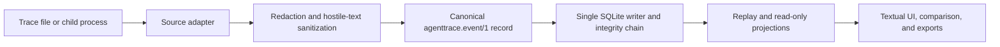

# Agent Observability TUI

Debug your local agents like a pro.

[](https://github.com/ContractorKeith/agent-observability-tui/actions/workflows/ci.yml)
[](https://github.com/ContractorKeith/agent-observability-tui/actions/workflows/codeql.yml)
[](LICENSE)

Agent Observability TUI is a local-first Textual application for importing, watching, running,
replaying, comparing, and exporting agent traces. It brings tool calls, captured MCP JSON-RPC,
process metrics, provider-reported tokens, local cost estimates, diagnostics, and evidence status
into one terminal workflow.

The v0.1 line is early-alpha software. It reads documented traces or supervises a child process;
it does **not** passively attach to an arbitrary running MCP connection. Hermes, OpenHands, and
captured MCP adapters are experimental. See [Adapters](docs/adapters.md) for the exact boundary.

## Quick start

You need Python 3.11 or newer and [`uv`](https://docs.astral.sh/uv/).

```bash
git clone https://github.com/ContractorKeith/agent-observability-tui.git
cd agent-observability-tui
uv sync --locked --all-groups
uv run agent-observe demo
```

Use the noninteractive demo in CI or when checking a terminal without opening the TUI:

```bash
uv run agent-observe demo --headless
```

The project is currently installed from source. It is **not published on PyPI**. To install the
wheel from a checkout as a standalone command, use `uv tool install .` or `pipx install .`.

## Core workflow

Import a completed trace. `auto` detects a supported shape and records the selected adapter and
version; choose an adapter explicitly when repeatability matters.

```bash
uv run agent-observe import ./trace.jsonl --adapter auto --json
uv run agent-observe sessions --json
```

Watch a trace file as another program appends complete lines:

```bash
uv run agent-observe watch ./live-trace.jsonl --adapter native
```

Supervise one child command. Everything after `--` is passed as an argument vector without a
shell:

```bash
uv run agent-observe run --cwd ./my-agent -- python agent.py --task demo
```

Replay and compare already-captured sessions. Comparison is read-only and never reruns a model:

```bash
uv run agent-observe replay SESSION_ID
uv run agent-observe replay SESSION_ID --headless
uv run agent-observe compare SESSION_A SESSION_B --json
```

Export sanitized evidence, then verify the stored session's local integrity chain:

```bash
uv run agent-observe export SESSION_ID ./evidence.json --format json
uv run agent-observe export SESSION_ID ./evidence.md --format markdown
uv run agent-observe verify SESSION_ID --json
uv run agent-observe verify-export ./evidence.json --json
```

Use `--db PATH` on commands that expose the option to select a database. Run
`uv run agent-observe --help` and the relevant subcommand's `--help` for the installed version's
authoritative options. The full command reference is in [CLI workflows](docs/cli.md).

Use `--prices PATH` (or `AGENT_OBSERVABILITY_PRICES`) to supply a reviewed versioned TOML price
catalog. Each newly captured session records the catalog version used; unknown models stay
`unpriced`.

## What v0.1 measures

| Signal | Meaning |
| --- | --- |
| Process RSS and CPU | Portable observations sampled with `psutil`; unavailable is reported explicitly. |
| Tokens | Accepted only when the source reports them; absent usage stays unknown. |
| Cost | Source-reported actual/estimated cost or a versioned local estimate, always with provenance; bundled rates are illustrative and unknown models remain unpriced. |
| Tool and error counts | Derived from sanitized, accepted events in the stored session. |
| Evidence chain | Detects accidental record edits, insertion, deletion, or reordering; it is not tamper-proof. |

Duration summaries declare whether they use complete source time or collector-observed time.
Mixed-model sessions retain a `mixed` aggregate and add directly attributed per-model rows.

Agent Observability TUI does not claim per-process Apple GPU or unified-memory attribution, query
provider billing APIs, score model quality, or automatically rerun sessions.

## How data moves



Raw input must not flow directly to the database, TUI, metrics, or exporter. Accepted events are
persisted before live projection. Source timestamps remain separate from collector timestamps,
and deterministic replay follows ingest sequence. Read [Architecture](docs/architecture.md) and
the [event schema](docs/event-schema.md) before adding an adapter.

For semantic agent/framework events, v0.1 retains metadata values plus unknown field names/shape
and replaces prompt, tool argument/result, arbitrary unknown prose, and body values with explicit
`[CONTENT OMITTED]` or `[VALUE OMITTED]` markers. Sanitized stdout/stderr from an explicitly
supervised child is the deliberate exception because observing those logs is the requested mode.

## Privacy and evidence limits

The runtime path is local and has no required service, account, API key, or telemetry upload.
Redaction, size bounds, control-sequence stripping, neutral rendering, and owner-only file
permissions reduce risk; they do not make arbitrary traces safe to publish. A command launched by
`run` may still use the network or modify the machine, and Agent Observability TUI is not a
sandbox.

The SHA-256 chain covers canonical **sanitized** records. It can reveal accidental local
corruption, but a local attacker who can rewrite the database can also recompute the chain. Review
[Privacy and threat model](docs/privacy-and-threat-model.md) and
[Evidence integrity](docs/evidence-integrity.md) before relying on or sharing an export.

## Documentation

- [CLI workflows](docs/cli.md)
- [Architecture and data flow](docs/architecture.md)
- [`agenttrace.event/1` schema](docs/event-schema.md)
- [Adapters and maturity](docs/adapters.md)
- [Privacy and threat model](docs/privacy-and-threat-model.md)
- [Evidence integrity](docs/evidence-integrity.md)
- [Roadmap](ROADMAP.md)

## Development

```bash
uv sync --locked --all-groups
uv run ruff check .
uv run ruff format --check .
uv run pytest -q
uv build
```

Changes to redaction, canonicalization, storage, adapters, replay, or export require tests that
exercise hostile input and prove that representative secrets and active terminal controls do not
reach durable, rendered, exported, logged, or test-artifact output.

## Community and trust

- [Contributing](CONTRIBUTING.md)
- [Code of Conduct](CODE_OF_CONDUCT.md)
- [Security policy](SECURITY.md)
- [Support](SUPPORT.md)
- [Changelog](CHANGELOG.md)
- [MIT License](LICENSE)

Never contribute real prompts, credentials, cookies, customer data, private tool output, or an
unsanitized session. Use synthetic fixtures designed for publication.
