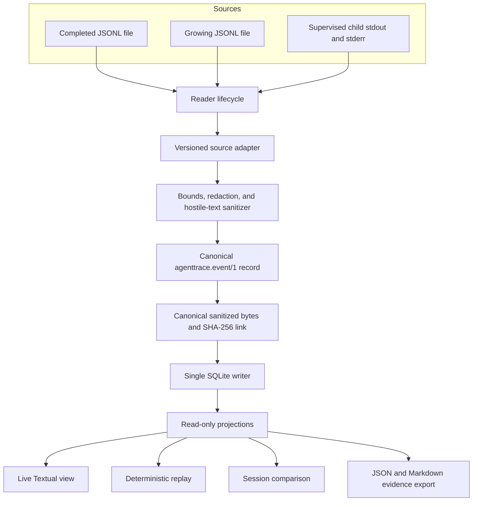

# Architecture and data flow

Agent Observability TUI is a local event pipeline with inbound source adapters and outbound
read-only views. `Observatory` is the application service coordinating the pipeline. The central
rule is simple: source input never flows directly to Textual, SQLite, metrics, logs, or exports.

## System flow



The same accepted canonical record drives live display, replay, summaries, comparison, and export.
That prevents each presentation path from interpreting raw source input differently.

## Inbound ports

The source lifecycle is explicit:

- **Import** reads a completed JSONL trace.
- **Watch** follows a documented trace file, holds partial lines until complete, and reports
  truncation, rotation, malformed input, or source loss as diagnostics.
- **Run** launches one child command as an argument vector with `shell=False`, drains stdout and
  stderr concurrently, samples portable process metrics, forwards termination signals, cleans its
  dedicated process group, and records terminal lifecycle events. A child may deliberately escape
  group cleanup by creating a new session; the supervisor is not a sandbox.
- **Replay** is not an inbound port. It reads stored events and never executes a tool, process, or
  agent.

Captured MCP JSON-RPC is an input format, not a connection interception mechanism. V0.1 does not
attach to arbitrary existing stdio or HTTP connections and does not implement a general MCP or
OTLP proxy.

## Safety gate

Input is treated as hostile. Before canonicalization, persistence, rendering, aggregation, export,
logging, or test-artifact capture, the pipeline applies:

1. bounded line, payload, and display sizes;
2. parsing with explicit diagnostics for malformed or unknown versions;
3. recursive secret-key and representative secret-value redaction;
4. ANSI, OSC, control-sequence, and unsafe markup neutralization;
5. visible truncation metadata; and
6. preservation of sanitized unknown field names/shape, with arbitrary scalar content omitted.

Redaction reduces exposure risk but cannot prove that arbitrary content is non-sensitive. The
project therefore does not treat sanitized output as automatically publishable.

## Canonical event contract

Every accepted event uses the versioned `agenttrace.event/1` envelope. It keeps source time and
collector observation time separate, records the adapter name and version, supports correlation
identifiers, and carries explicit provenance for usage and cost data. See
[Event schema](event-schema.md).

The collector assigns `ingest_sequence`. It is the deterministic replay order even when source
timestamps are missing, equal, late, or out of order. Source timestamps remain evidence about the
source; they are not rewritten to make a timeline look cleaner.

## Persistence

SQLite lives in an owner-local platform data directory unless a command accepts an explicit
`--db` path. The store uses WAL mode, schema migrations, one writer, and indexed reads by session
sequence and correlation IDs.

- Canonical sanitized event rows are immutable.
- Session metadata, summaries, retention state, and other projections may be updated.
- Accepted live events are committed before they are projected into the TUI.
- Database and export files request owner-only permissions where the operating system supports
  them.
- An empty data directory can recreate the current schema through migrations.

SQLite is mutable storage, not a security boundary. The integrity chain is designed to expose
accidental corruption, not defeat a local attacker. See [Evidence integrity](evidence-integrity.md).

## Metrics and provenance

The analysis layer distinguishes facts by origin:

- RSS and CPU are observations sampled through `psutil` for a supervised process and are marked
  unavailable when the platform or process lifecycle prevents a reliable sample.
- Token counts are accepted only when reported by the source.
- Cost may be source-reported as actual/estimated or derived from a versioned local catalog.
  Provenance is retained in either case, and a local estimate is frozen into the immutable event
  at ingest so later catalog changes do not rewrite historical summaries. Bundled v0.1 entries
  are illustrative; users must configure current provider rates for a provider-specific estimate.
- Unknown models remain `unpriced`; missing tokens or platform metrics remain unknown.

Session duration uses source timestamps only when every accepted event has one; otherwise it uses
collector-observed timestamps for the whole session. The summary records that basis instead of
mixing clocks. Mixed-model comparisons include a session aggregate and directly attributed
per-model rows; unscoped events are not guessed onto a model.

No component infers Apple GPU or unified-memory attribution, contacts provider billing APIs, or
turns a local estimate into an invoice claim.

## Read paths

The TUI, headless summary, replay, comparison, verification, and exporters read only sanitized
stored data or derived projections.

- UI pause and filtering affect rendering, not ingestion.
- High event rates may coalesce refreshes, but accepted durable events are not silently dropped.
- Detail rendering is bounded and exposes truncation.
- Comparison reads captured sessions and never reruns an agent.
- JSON and Markdown exports are written atomically and identify their schema, filters, safety
  policy, provenance, and chain status.

## Dependency direction

```text
source readers and child supervisor
  -> adapters
    -> safety and canonical event model
      -> store and integrity service
        -> projections and analysis
          -> CLI, Textual UI, replay, comparison, and exporters
```

Presentation and adapters can evolve independently as long as both depend on the canonical event
contract. An adapter may be disabled without changing storage, and the UI may change without
migrating immutable event rows.

## Failure semantics

The project favors explicit missing or diagnostic state over fabricated continuity:

- malformed or unsupported input produces a diagnostic;
- duplicate, out-of-order, truncation, rotation, and source-loss conditions remain visible;
- unavailable resource samples remain unavailable;
- missing usage stays missing and unknown prices stay unpriced;
- an unfinalized or incomplete chain is reported as such; and
- a failed verification is not silently repaired.

For the security assumptions around these choices, read
[Privacy and threat model](privacy-and-threat-model.md).
