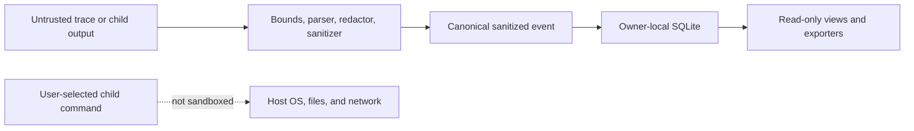

# Privacy and threat model

Agent Observability TUI is local-first: the application runtime does not require a hosted service,
account, API key, cloud database, telemetry upload, or network dependency. That boundary limits
exposure; it does not make arbitrary agent traces safe.

## Protected assets

The design aims to reduce accidental exposure or unsafe rendering of:

- credentials, tokens, cookies, authorization values, and secret-like nested fields;
- prompts, tool arguments, tool results, paths, hostnames, repository content, and customer data;
- terminal state affected by ANSI, OSC, control characters, or injected markup;
- local session databases and evidence exports; and
- the accuracy of session ordering, metrics provenance, and missing-data state.

Full raw prompt and tool-content retention is not enabled by default. Semantic adapters retain
allowlisted metadata plus unknown field names/shape, using `[CONTENT OMITTED]` and
`[VALUE OMITTED]` for content. Sanitized stdout/stderr from an explicitly supervised child is the
intentional exception. Producers should still minimize input before it reaches the application.

## Trust boundaries

The source side of the safety gate is untrusted. The canonical event is safe to process according
to the configured policy, but is not automatically safe to publish. The owner-local database is
trusted for ordinary operation, not against a malicious local user with equivalent filesystem
access.

## Threats addressed in v0.1

### Secret propagation

Recursive key/value redaction runs before canonicalization, persistence, display, export, logging,
or test-artifact capture. Tests cover representative password, authorization, cookie, token-like,
and nested secret inputs.

Limit: secrets can use unexpected forms or appear in ordinary prose. Automated redaction is a
defense-in-depth measure, not a completeness proof. Inspect output before sharing it.

### Terminal and markup injection

ANSI, OSC, control-sequence, and unsafe markup content is neutralized before rendering. Textual and
Rich markup from traces is not trusted. Rendered detail and source lines are bounded, with visible
truncation metadata.

Limit: a newly discovered terminal-parser edge case may need an update. Report reproducible cases
privately if they have security impact.

### Oversized, malformed, and misleading input

Readers and adapters enforce bounds and surface malformed JSON, unsupported versions, duplicate or
out-of-order data, partial lines, truncation, rotation, and source loss as diagnostics. Sanitized
unknown field names/shape are retained within bounds so adapter drift can be diagnosed without
retaining arbitrary scalar prose.

Limit: bounds reduce memory and rendering pressure but do not turn the application into a service
safe for hostile multi-tenant input.

### Command injection and process lifecycle

`run` launches one child from an argument vector with `shell=False`, concurrently drains stdout and
stderr, forwards termination signals, and cleans up the dedicated process group it creates.

Limit: the selected command executes with the user's permissions. It may access files, credentials,
or the network. A child can intentionally escape group cleanup by creating a new session/process
group; Agent Observability TUI is not a sandbox or policy enforcement engine.

### Accidental evidence corruption

Canonical sanitized records are chained in ingest order and verified for edit, insertion,
deletion, or reordering. Exports are atomic and include chain status.

Limit: an attacker who can rewrite local storage can recompute the chain. The chain does not prove
who created a trace, when it existed, or that the source event was truthful.

### Misleading metrics

Resource samples, tokens, and costs carry provenance. Missing data is not converted to zero.
Tokens are source-reported; costs are source-reported actual/estimated values or versioned local
estimates with provenance; RSS/CPU are portable process observations.

Limit: source-reported usage or cost can be incomplete or wrong, sampling can miss peaks, and
estimates can differ from provider invoices. Bundled v0.1 catalog entries are illustrative, not
current provider prices. V0.1 has no per-process Apple GPU or unified-memory attribution.

## Threats not addressed in v0.1

- A malicious local user with the same or greater filesystem permissions.
- Adversarial evidence notarization, signed capture hardware, or an external timestamp authority.
- Sandboxing or behavioral control of the supervised child.
- Passive interception of arbitrary stdio or HTTP MCP connections.
- Cloud account, organization, multi-user, or tenant isolation because those systems do not exist.
- Security of a framework before it writes a captured trace.
- Network activity, credentials, or side effects initiated by the user-selected child.
- Provider billing correctness or model-output quality evaluation.

## Data lifecycle

1. A source file or child output enters an adapter.
2. Bounds, redaction, and hostile-text sanitization run.
3. A canonical sanitized event and integrity link are created.
4. The accepted event is persisted before live projection.
5. Replay, summaries, comparison, and export read sanitized stored data.
6. Retention and deletion remain local user responsibilities.

No cloud copy is required or created by the application. Database and export files request
owner-only permissions where supported. Filesystem permissions can still be changed by the user or
other software.

## Safe operating guidance

- Prefer synthetic or minimized producer output.
- Run agents with only the credentials and filesystem access they need.
- Use an isolated `--db` for an investigation when the command exposes that option.
- Treat databases, screenshots, logs, and exports as sensitive.
- Verify a session before relying on its evidence status.
- Inspect exports manually before sharing and use a separate secure transfer mechanism.
- Never post a real trace to an issue; follow [Security](../SECURITY.md) for vulnerabilities.

Contributors must follow the stricter publication rules in [Contributing](../CONTRIBUTING.md).
